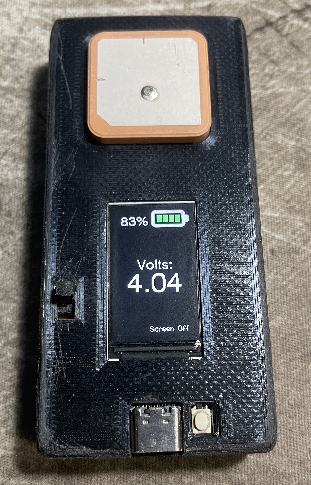

# rc-diy-gps-tdisplay

A custom 15Hz GPS to be used with RaceChrono over BLE.

Components : 
- TTGO T-Display ESP32
- Beitian BN-357 GPS
- Salvaged 850 mAh 353574 Lipo
- SS12F15 Slide Switch
- 3D printed case

Credits:
- https://github.com/0x8008135/RaceChronoDYI-TBeam for the racechrono protocol implementation
- https://github.com/0015/ThatProject/tree/master/ESP32_TTGO/TTGO_Battery_Indicator for the battery indicator
- https://github.com/pangodream/18650CL for the battery voltage / charge level reference table

Tjpg Decoder library (https://github.com/Bodmer/TJpg_Decoder) included due to the PlatformIO version being too old.